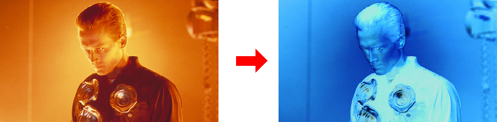
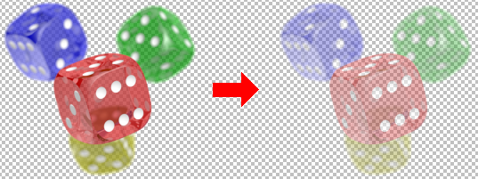
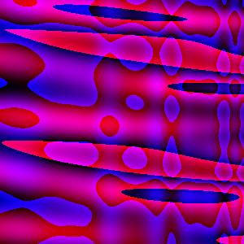
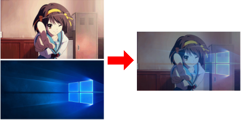

# BitmapPixels
### BitmapPixels.pas  - Lazarus and Delphi module for direct access to pixels at TBitmap
#### Worked on Windows(WinApi), Linux(GTK2, Qt5), OSX(Cocoa)

Quite a popular question is how to get quick access to **TBitmap** pixels?  
It is easy to do in **Delphi**, with **Scanline[]** property, due to the limited number of pixel formats, but rather difficult in **Lazarus**.   
For example: https://wiki.freepascal.org/Fast_direct_pixel_access  

I propose a small, single file, module **"BitmapPixels.pas"** that simplify work to just calling **TBitmapData.Map()** and **TBitmapData.Unmap()**.  
You get an array of **$AARRGGBB** pixels in the **Data** property, and abilty set and get color of pixels using **SetPixel()/GetPixel()**.  

```delphi
var
  Data: TBitmapData;
  X, Y: Integer;
  Pixel: TPixelRec;// for easy access to the channels 
begin
  // Reading the colors of the image into map "Data", width mode "ReadWrite", in the "False" alpha channel mode.
  // The alpha channel will be set to 0 on every element of the array. ($00RRGGBB, $00RRGGBB, ...) 
  Data.Map(Bitmap, TAccessMode.ReadWrite, False);
  try
    for Y := 0 to Data.Height - 1 do
    begin
      for X := 0 to Data.Width - 1 do
      begin
        // Read color at (X, Y) to Pixel record
        Pixel := Data.GetPixel(X, Y);
        // some changes of Pixel
        Pixel.R := (Pixel.R + Pixel.G + Pixel.B) div 3;
        Pixel.G := Pixel.R;
        Pixel.B := Pixel.R;
        // ...
        // Write Pixel record to (X, Y) in map
        Data.SetPixel(X, Y, Pixel);
      end;
    end;
  finally
    // Writing the map to the image.
    // Since we have abandoned Alpha, the pixel format will be set to pf24bit.
    Data.Unmap();
  end;
end;
```

**Key Features:**
- cross-platform 
- supports all TBitmap pixel formats for reading 
- fast processing of popular formats in Windows/GTK/Qt/OSX 
- can map any image as having an alpha channel or not (24bit/32bit)

---
#### Example 1 - Invert colors (read and write)

```delphi
procedure InvertColors(const Bitmap: TBitmap);
var
  Data: TBitmapData;
  X, Y: Integer;
  Pixel: TPixelRec;
begin
  Data.Map(Bitmap, TAccessMode.ReadWrite, False);// RGB access
  try
    for Y := 0 to Data.Height - 1 do
    begin
      for X := 0 to Data.Width - 1 do
      begin
        Pixel := Data.GetPixel(X, Y);
        Pixel.R := 255 - Pixel.R;
        Pixel.G := 255 - Pixel.G;
        Pixel.B := 255 - Pixel.B;
        Data.SetPixel(X, Y, Pixel);
      end;
    end;
  finally
    Data.Unmap();
  end;
end; 
```
#### Example 2 - Half bitmap transparency (read and write, alpha)

```delphi
procedure HalfAlpha(const Bitmap: TBitmap);
var
  Data: TBitmapData;
  X, Y: Integer;
  Pixel: TPixelRec;
begin
  Data.Map(Bitmap, TAccessMode.ReadWrite, True);// ARGB access
  try
    for Y := 0 to Data.Height - 1 do
    begin
      for X := 0 to Data.Width - 1 do
      begin
        Pixel := Data.GetPixel(X, Y);
        Pixel.A := Pixel.A div 2;
        Data.SetPixel(X, Y, Pixel);
      end;
    end;
  finally
    Data.Unmap();
  end;
end; 
```
#### Example 3 - Make a plasm effect on bitmap (write only)

```delphi
function MakePlasm(): TBitmap;
var
  Data: TBitmapData;
  X, Y: Integer;
  Pixel: TPixelRec;
begin
  Result := TBitmap.Create();
  Result.SetSize(300, 300);

  Data.Map(Result, TAccessMode.Write, False);
  try
    for Y := 0 to Data.Height - 1 do
    begin
      for X := 0 to Data.Width - 1 do
      begin
        Pixel.R := Byte(Trunc(
          100 + 100 * (Sin(X * Cos(Y * 0.049) * 0.01) + Cos(X * 0.0123 - Y * 0.09))));
        Pixel.G := 0;
        Pixel.B := Byte(Trunc(
          Pixel.R + 100 * (Sin(X * Cos(X * 0.039) * 0.022) + Sin(X * 0.01 - Y * 0.029))));
        Data.SetPixel(X, Y, Pixel);
      end;
    end;
  finally
    Data.Unmap();
  end;
end;
```
#### Example 4 - Mix two bitmaps to one bitmap (read only, write only)

```delphi
function Mix(const A, B: TBitmap): TBitmap;
  function Min(A, B: Integer): Integer;
  begin
    if A < B then Exit(A) else Exit(B);
  end;
var
  DataA, DataB, DataResult: TBitmapData;
  X, Y: Integer;
  PixelA, PixelB, PixelResult: TPixelRec;
begin
  Result := TBitmap.Create();
  Result.SetSize(Min(A.Width, B.Width), Min(A.Height, B.Height));
  // this needed for correct Unmap() on exception
  DataA.Init();
  DataB.Init();
  DataResult.Init();
  try
    DataA.Map(A, TAccessMode.Read, False);
    DataB.Map(B, TAccessMode.Read, False);
    DataResult.Map(Result, TAccessMode.Write, False);
    for Y := 0 to DataResult.Height - 1 do
    begin
      for X := 0 to DataResult.Width - 1 do
      begin
        PixelA := DataA.Pixels[X, Y];
        PixelB := DataB.Pixels[X, Y];
        PixelResult.R := (PixelA.R + PixelB.R) div 2;
        PixelResult.G := (PixelA.G + PixelB.G) div 2;
        PixelResult.B := (PixelA.B + PixelB.B) div 2;
        DataResult[X, Y] := PixelResult;
      end;
    end;
  finally
    DataA.Unmap();
    DataB.Unmap();
    DataResult.Unmap();
  end;
end;
```
